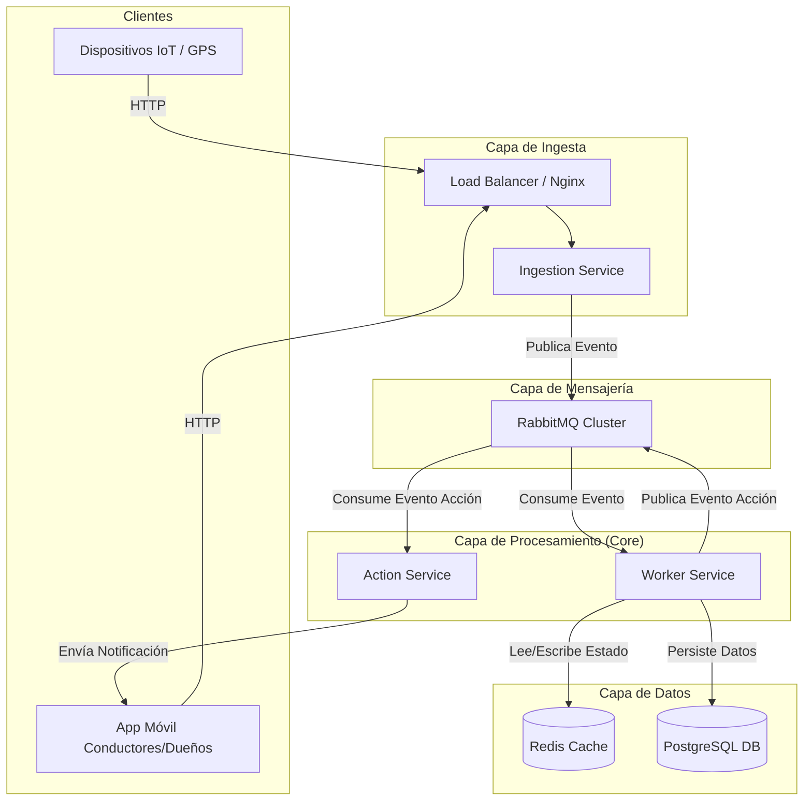
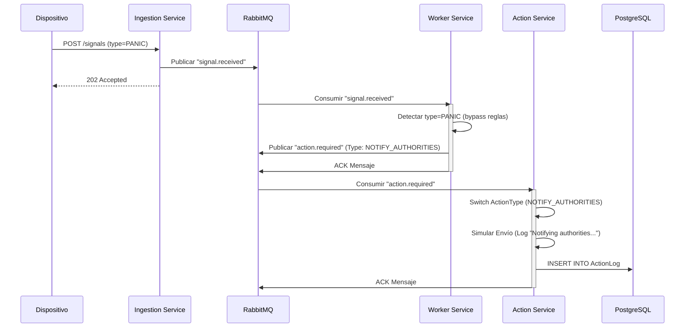
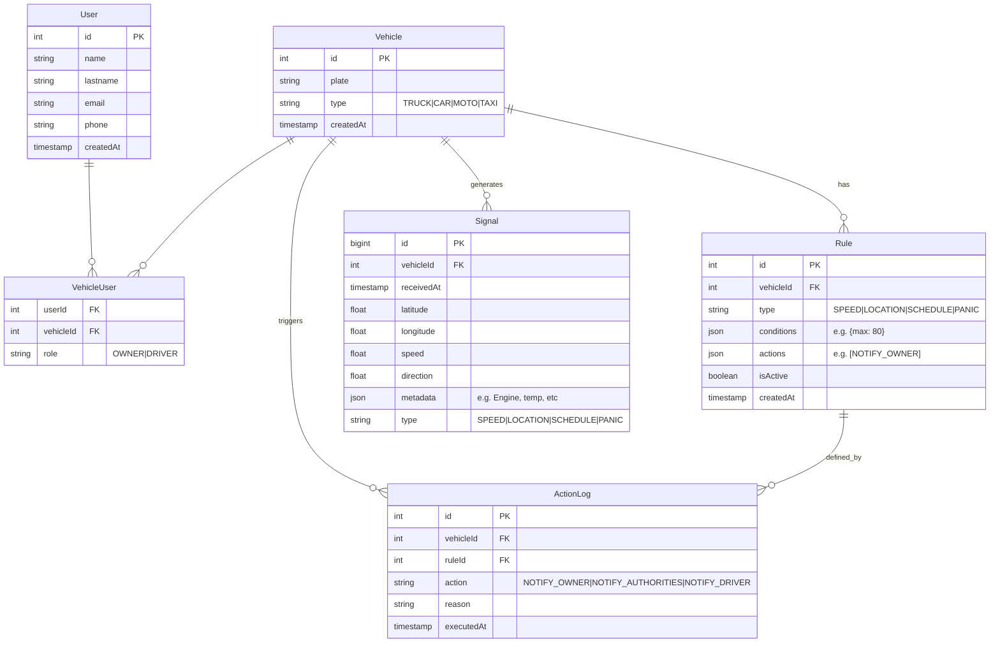

# CCS Central - Sistema de Seguimiento Vehicular


> Este proyecto fue la solución a una prueba técnica para evaluar competencias como Arquitecto de Software. El contexto del problema no es de mi autoría; la arquitectura, diseño y implementación sí.

## Contexto del Problema

CCS es la Compañía Colombiana de Seguimiento de Vehículos. CCS se encarga del monitoreo y seguimiento de vehículos de carga, vehículos de transporte público y vehículos particulares incluidas motocicletas.

CCS instala sensores en los vehículos de forma que sea posible en todo momento conocer su localización, velocidad y dirección. En el caso particular de los vehículos de carga, se desea conocer el estado de la carga, temperatura de la carga, detenciones planeadas y no planeadas, y accidentes que pueda tener cada cargue durante el transporte de la carga. En el caso de los camiones, cada vehículo tiene una cámara interna que graba todo lo que ocurre al interior de la cabina. Todos los vehículos cuentan con un botón de pánico en caso de que se presente una emergencia. Los conductores adicionalmente tienen una aplicación móvil, desde la cual pueden accionar igualmente un llamado de emergencia en caso de que requieran ayuda por problemas mecánicos o eventualidades de seguridad.

CCS tiene una central en la que se consolidan todas las señales provenientes tanto de camiones como de vehículos. En esta central se analizan todos los datos recibidos y en caso de detectar una situación anómala o recibir una señal de emergencia, se informa tanto a las autoridades respectivas, como a organismos de socorro e interesados (propietario del camión).

Los propietarios de los vehículos pueden definir, mediante una aplicación móvil, las acciones a realizar desde la central en caso de eventos que ocurran con el vehículo. Por ejemplo, el propietario de un camión puede definir una regla asociada a una detención no planeada. En caso de que el vehículo se detenga se debe enviar un mensaje al propietario del camión indicando lo que está sucediendo. Otro ejemplo podría ser, si un vehículo de transporte público como un taxi, se está moviendo en un horario en el que debería estar detenido. En ese caso se le debe enviar un mensaje al propietario. En el caso de un botón de pánico, una regla podría ser la llamada a las autoridades para informar lo que está sucediendo.

CCS cuenta actualmente con 1,500 camiones, 5,000 vehículos y 3,000 motocicletas afiliadas. CCS espera incrementar en un 20% sus afiliados anualmente durante los siguientes 3 años.

**Reto:** Diseñar la arquitectura de la central de CCS para garantizar que se pueden manejar todas las señales y tomar las acciones correspondientes de forma rápida. Ante una señal de emergencia se debe poder ejecutar todas las acciones programadas en menos de 2 segundos. Adicionalmente, se deben poder procesar 500 señales por segundo, hasta por periodos de 2 minutos.

**Objetivo:** Diseñar una arquitectura de software para el sistema propuesto e implementar experimentos que validen los requisitos.

---

## Requisitos No Funcionales

| Requisito                  | Meta                                        | Cómo se cumple                                                                         |
| -------------------------- | ------------------------------------------- | -------------------------------------------------------------------------------------- |
| **Throughput**             | 500 señales/seg por periodos de 2 min       | RabbitMQ como buffer amortiguador; Workers desacoplados y Stateless                    |
| **Latencia de emergencia** | < 2 segundos (señal → acción ejecutada)     | Redis cache-aside para reglas (sub-ms); bypass de evaluación para señales PANIC        |
| **Crecimiento proyectado** | +20% afiliados/año × 3 años                 | Contenedores Docker; despliegue diseñado para orquestación (Kubernetes/ECS)            |
| **Disponibilidad**         | El sistema no debe perder señales           | Colas durables con ACK manual; mensajes nacked se reencolan para reintento             |
| **Consistencia**           | Estado vehicular coherente entre cache y BD | Redis almacena estado caliente (última posición); Postgres persiste histórico completo |
| **Trazabilidad**           | Registro de todas las acciones ejecutadas   | ActionLog persiste cada notificación disparada con timestamps y resultado              |

---

## Arquitectura

Se propone una **Arquitectura Orientada a Eventos** usando RabbitMQ para desacoplar la ingesta del procesamiento. Esto es crítico para manejar la ráfaga de 500 señales/seg sin pérdida de datos. Se utiliza Redis para caché de estado de vehículos y reglas, asegurando el requisito de latencia <2s; consultar Postgres para cada señal sería demasiado lento.

El desarrollo se realiza en entorno local, pero la arquitectura está diseñada para un entorno productivo.

- **Ingestion Service (NestJS)**: API Gateway HTTP. Recibe señales y las publica en RabbitMQ.
- **RabbitMQ**: Broker de mensajería para desacoplar carga.
- **Worker Service (NestJS)**: Procesa reglas de negocio.
  - Usa **Redis** para caché de reglas y estado.
  - Usa **PostgreSQL** para persistencia histórica.
- **Actions Service (NestJS)**: Ejecuta notificaciones (simuladas) y registra acciones.

### Visión General

El sistema sigue un enfoque de **Monorepo** (Monolito Modular), contenerizado con Docker.

**Flujo:**

1. **Dispositivos** (Camiones, Vehículos, Apps) envían señales -> **Servicio de Ingesta** (HTTP).
2. **Servicio de Ingesta** valida y envía a -> **Broker de Mensajería** (RabbitMQ).
3. **Servicio de Procesamiento** (Worker) consume mensajes.
   - Verifica **Redis** para reglas activas (cache-aside).
   - Detecta Anomalías/Emergencias.
   - Actualiza Estado del Vehículo en **Redis** (Caliente) y **Postgres** (Frío).
4. **Servicio de Acciones** dispara notificaciones (Email, SMS, Webhook) cuando se infringen reglas. Las notificaciones están simuladas por log, ya que no se conecta a servicios de mensajería externos.

### Justificación de Componentes

#### 1. Capa de Ingesta (NestJS)

- **Por qué:** NestJS provee excelente soporte para HTTP y Microservicios con tipado fuerte.
- **Rol:** Gateway ligero. Recibe payload, validación básica, fire-and-forget a la cola.
- **Escalabilidad:** Escalado horizontal detrás de un Balanceador de Carga (Nginx/AWS ALB).

#### 2. Broker de Mensajería (RabbitMQ)

- **Por qué:** Esencial para el requisito de 500 señales/seg. Actúa como amortiguador. Si la BD se ralentiza, la cola retiene el backlog sin pérdida de datos.
- **Alternativas descartadas:** Kafka (excesivo para este volumen y alcance), Redis Pub/Sub (sin persistencia de mensajes). RabbitMQ es el punto medio ideal entre capacidad y complejidad operativa.

#### 3. Núcleo de Procesamiento (NestJS Worker)

- **Por qué:** Desacoplado del API. Puede procesar mensajes a su propio ritmo sin bloquear la ingesta.
- **Lógica:**
  - Señales PANIC: bypass completo de evaluación de reglas, dispatch inmediato de acción.
  - Señales estándar: evaluación de reglas contra cache, despacho de acción solo si se viola una regla.

#### 4. Estrategia de Almacenamiento

- **Redis (Datos Calientes):**
  - Almacena: `Vehicle:{id}:LastState`, `Vehicle:{id}:Rules`.
  - Por qué: Leer reglas de Postgres 500 veces/seg es costoso. Redis responde en sub-milisegundo.
- **Postgres + Prisma (Persistencia):**
  - Almacena: Usuarios, Vehículos, Reglas Configuradas, Señales Históricas, Logs de Acciones.
  - Por qué: Integridad relacional, consultas potentes para reportes. Prisma provee seguridad de tipos end-to-end.

#### 5. Infraestructura (Docker)

- **Por qué:** Reproducibilidad del entorno y preparación para despliegue productivo con orquestación.

---

## Decisiones Arquitectónicas

### 1. Monorepo vs Microservicios Desplegados Separadamente

Se eligió un **monorepo con NestJS CLI** porque los tres servicios comparten DTOs, modelos de Prisma y el cliente de Redis. Un monorepo simplifica el desarrollo, los tests y el despliegue en la fase actual. Para escalar a nivel de infraestructura, cada app se contenedoriza independientemente con su propio Dockerfile, permitiendo despliegues separados sin cambiar el código fuente.

### 2. RabbitMQ vs Kafka vs Redis Streams

- **Kafka:** Diseñado para throughput masivo (millones de eventos/sec) y retención histórica. Para este caso (500 señales/seg), su complejidad operativa no se justifica para este volumen.
- **Redis Streams:** Persistencia limitada, sin garantías de delivery at-least-once. Riesgo de pérdida de señales.
- **RabbitMQ:** Soporte nativo para colas durables, ACK manual, dead-letter queues, y priorización. Cumple el requisito de throughput con menor complejidad.

### 3. Cache-Aside para Reglas

Las reglas de negocio se cargan desde Postgres y se cachean en Redis. Cuando una regla se actualiza, se invalida la clave correspondiente. Esto evita 500 consultas a Postgres por segundo manteniendo consistencia eventual aceptable.

### 4. Bypass de Evaluación para PANIC

Las señales de pánico son el caso de uso más crítico (latencia < 2s). En lugar de evaluar todas las reglas del vehículo, el Worker detecta `type=PANIC` y despacha inmediatamente la acción `NOTIFY_AUTHORITIES` sin consultar Redis ni Postgres. Esto reduce la latencia del path crítico a un solo publish a RabbitMQ.

### 5. Denormalización de Acciones en Rule

En el modelo, las acciones asociadas a una regla se almacenan como un array JSON dentro de `Rule.actions`. Esto evita un JOIN con una tabla `Action` en cada evaluación. La tabla `ActionLog` mantiene la trazabilidad completa de cada acción ejecutada.

---

## Diagramas

### 1. Diagrama de Componentes y Despliegue



### 2. Diagramas de Secuencia

#### Flujo 1: Ingesta y Procesamiento de Señal Estándar

```mermaid
sequenceDiagram
    participant D as Dispositivo/Postman
    participant I as Ingestion Service
    participant Q as RabbitMQ
    participant W as Worker Service
    participant R as Redis
    participant DB as PostgreSQL
    participant A as Actions

    %% 1. Ingesta
    D->>I: POST /signals
    I->>I: Validar DTO (vehicleId, etc.)
    I->>Q: Publicar "signal.received"
    I-->>D: 202 Accepted

    %% 2. Procesamiento
    Q->>W: Consumir "signal.received"
    activate W

    %% 3. Obtención de Reglas (Cache-Aside)
    W->>R: GET vehicle:{id}:rules
    alt Cache Miss
        R-->>W: null
        W->>DB: SELECT * FROM Rule WHERE vehicleId={id}
        DB-->>W: Reglas (e.g. MaxSpeed=80)
        W->>R: SET vehicle:{id}:rules
    else Cache Hit
        R-->>W: Reglas JSON
    end

    %% 4. Evaluación de Reglas
    W->>W: Evaluar Reglas (Switch Case)

    alt Regla Violada (e.g. Speed > MaxSpeed)
        W->>Q: Publicar "action.required" (Reason: SPEED_LIMIT)

        Q->>A: Consumir "action.required"

        A->>A: Ejecutar acciones (simuladas por log)

        A->>DB: INSERT INTO ActionLog

        A->>Q: ACK Mensaje
    end

    %% 5. Persistencia y Estado
    W->>R: SET vehicle:{id}:last_state
    W->>DB: INSERT INTO Signal

    W->>Q: ACK Mensaje
    deactivate W
```



#### Flujo 2: Señal de Pánico (Path Crítico)

Las señales de tipo PANIC bypass-evalúan todas las reglas del vehículo para garantizar la mínima latencia posible. El Worker detecta el tipo de señal y despacha inmediatamente la acción de notificación a autoridades.



### 3. Modelo Entidad-Relación (ER)

Diseño optimizado para escalabilidad. Las tablas de alto volumen (Signal) se particionan por tiempo o se migran a almacenamiento en frío cuando superan el período de retención activo.



### Justificación del Modelo de Datos

1. **User:** Información estática del usuario. Rol para distinguir OWNER/DRIVER.
2. **VehicleUser:** Relación muchos a muchos entre usuarios y vehículos.
3. **Vehicle:** Información estática del vehículo. Esta tabla es fuente de verdad para consultas históricas.
4. **Rule:** Configuración de reglas por vehículo. El campo `actions` es un JSON con el array de acciones a ejecutar cuando se infringe la regla (denormalización deliberada para evitar JOINs en tiempo real). Las reglas se cargan en Redis al inicio y se invalidan al actualizarse.
5. **Signal:** Tabla de alto crecimiento (500 inserciones/seg en pico). Clave primaria BigInt para soportar volúmenes masivos. Índice compuesto en `(vehicleId, receivedAt)` para consultas por vehículo en rangos de tiempo. Se recomienda particionamiento por tiempo (Time-Series) o migración a almacenamiento en frío.
6. **ActionLog:** Trazabilidad completa de cada acción ejecutada. Registra qué notificación se disparó, por qué regla, y cuándo.

---

## Manejo de Errores y Resiliencia

### Mensajes Fallidos (NACK)

Tanto el Worker como el Actions Service utilizan ACK manual. Si el procesamiento de un mensaje falla, se envía un `nack` con reencolamiento (`requeue: true`), permitiendo un reintento automático.

### Dead-Letter Queue (Planificado)

En un entorno productivo, después de N reintentos fallidos, los mensajes se dirigirían a una Dead-Letter Queue (DLQ) para inspección manual. Esto evita loops infinitos de reintento que podrían bloquear la cola principal.

### Fallo de Redis

Si Redis no está disponible, el Worker funciona en modo degradado: consulta las reglas directamente desde Postgres en cada señal. El throughput disminuye pero el sistema no se detiene.

### Fallo de PostgreSQL

Si Postgres cae, el Worker continúa procesando señales y actualizando Redis (estado caliente). Las señales se reencolan para persistir cuando la BD se recupere. RabbitMQ retiene los mensajes hasta que el consumer pueda procesarlos.

### Fallo de RabbitMQ

El Ingestion Service no puede publicar mensajes. Se retorna HTTP 503 Service Unavailable al cliente, indicando que reintenten. Esto es preferible a perder datos silenciosamente.

---

## Escalabilidad Futura

### Crecimiento Proyectado

Con un 20% de crecimiento anual, el sistema pasaría de ~9,500 vehículos actuales a ~16,400 en 3 años. Asumiendo una tasa de señalización promedio de 1 señal/seg/vehículo:

| Año        | Vehículos | Throughput esperado | Instancias Worker |
| ---------- | --------- | ------------------- | ----------------- |
| 0 (actual) | ~9,500    | ~500/seg (pico)     | 1                 |
| 1          | ~11,400   | ~600/seg            | 2                 |
| 2          | ~13,680   | ~720/seg            | 2                 |
| 3          | ~16,416   | ~860/seg            | 3                 |

### Optimizaciones a Futuro

- **Particionamiento de Signal:** Dividir la tabla por meses o trimestres para mantener tiempos de consulta constantes.
- **Migración a Kubernetes:** Orquestación automática de contenedores con HPA (Horizontal Pod Autoscaler) basado en métricas de RabbitMQ (message depth).
- **Monitoring:** Integración con logs de monitoreo para métricas de latencia, throughput y salud de colas.
- **Rate Limiting:** Limitar la tasa de ingestión por vehículo para prevenir abusos.

---

## Prerrequisitos

- Docker & Docker Compose
- Node.js v18+
- NPM

## Instrucciones de Ejecución

### 1. Infraestructura

Levantar los servicios base (RabbitMQ, Redis, Postgres):

```bash
docker-compose up -d
```

### 2. Instalación

#### 2.1 Instalar dependencias:

```bash
npm install --force
```

#### 2.2 Inicializar el agente de base de datos:

```bash
npx prisma generate
npx prisma migrate dev
```

#### 2.3 Ejecutar la semilla de datos iniciales:

```bash
npx ts-node prisma/seed.ts
```

### 3. Ejecución de Microservicios

Se recomienda usar terminales separadas para ver los logs de cada servicio.

**Terminal 1: Ingesta**

```bash
npm run start:dev ingestion
```

**Terminal 2: Worker**

```bash
npm run start:dev worker
```

**Terminal 3: Actions**

```bash
npm run start:dev actions
```

### 4. Pruebas

#### Prueba Unitaria

```bash
npm run test
```

#### Prueba de Carga (Artillery)

Simular 500 peticiones/segundo:

```bash
npx artillery run load-test.yaml
```

#### Verificación de Latencia

Script E2E que envía una señal de PÁNICO y mide el tiempo de respuesta:

```bash
npx ts-node verify-latency.ts
```

---

## Estructura del Proyecto

```
├── apps/
│   ├── ingestion/          # API Gateway HTTP
│   │   └── src/
│   ├── worker/             # Procesador de eventos y reglas
│   │   └── src/
│   └── actions/            # Ejecutor de notificaciones
│       └── src/
├── libs/
│   └── shared/             # DTOs, PrismaService, RedisService
├── prisma/
│   ├── schema.prisma       # Modelo de base de datos
│   ├── seed.ts             # Datos iniciales
│   └── migrations/         # Migraciones de Prisma
├── docker-compose.yml      # Infraestructura (RabbitMQ, Redis, Postgres)
├── Dockerfile              # Contenedor de las apps NestJS
├── load-test.yaml          # Configuración de Artillery
├── verify-latency.ts       # Script de verificación E2E
└── package.json
```
